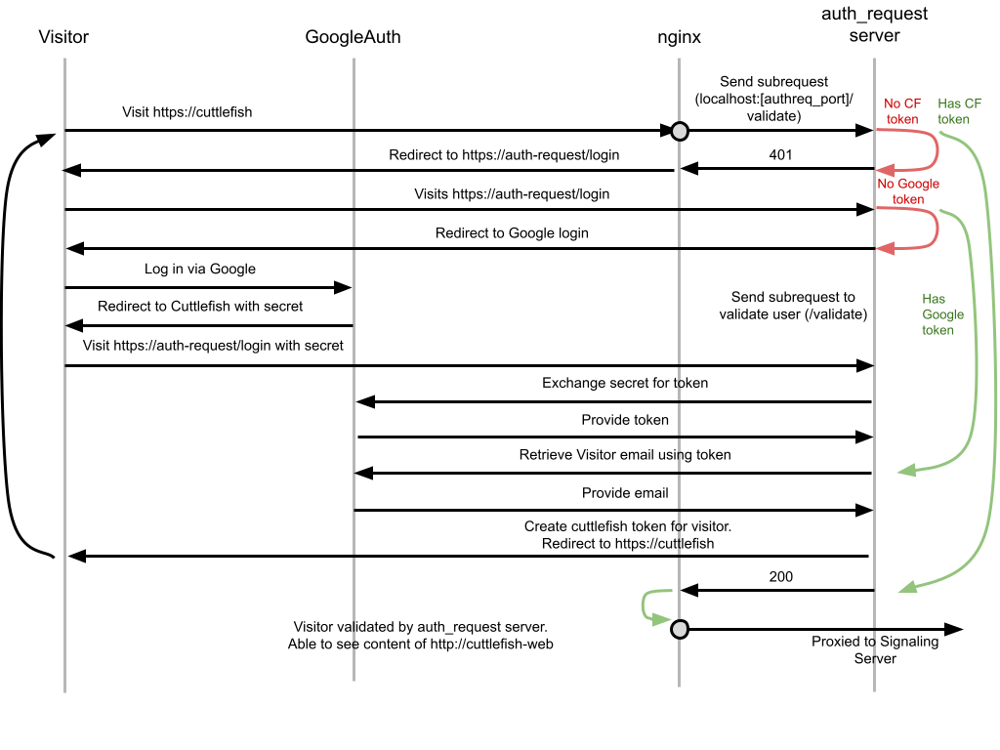

# Authentication with Cuttlefish

[Cuttlefish](https://source.android.com/setup/create/cuttlefish), also known as Cloud Android, is a framework for running virtual instances of Android in the cloud. It is a powerful tool that can be used for framework development, vendor integration, testing, and many other solutions. In the current Cuttlefish setup, the user can start up a virtual instance and serve a webpage that contains the video and audio output of the virtual Android instance; the page also provides input methods to allow visitor to interact with the instance.

While streaming the output of a virtual instance is very useful, this setup is meant for local development; the WebRTC server (that enables this feature) uses a self-signed certificate, which will induce browser warnings when a visitor tries to access the service via the public web (outside of `localhost`). Additionally, if the user starts this service on a publicly visible domain or IP, any visitor to the page will be able to interact with the virtual instance, which is often not the intended use.

To address the above mentioned shortcomings, we provide an example of how to add authentication to Cuttlefish. We leverage *nginx* and its [request validation](http://nginx.org/en/docs/http/ngx_http_auth_request_module.html) directive to validate requests and use Google's Oauth2 framework to authenticate a visitor by verifying their email address against a user-provided list of addresses.

This project is meant to be a proof-of-concept for providing Cuttlefish as a web service.

Clarification:
 - *User* refers to the entity starting the cuttlefish and authentication server. This is the entity who wishes to provide Cuttlefish as a web service.
 - *Visitor* is the entity visiting the public web page, who wishes to use Cuttlefish as a service.

## Prerequisites
 - [nginx](https://www.nginx.com/resources/wiki/start/topics/tutorials/install/)
 - python3
   - packages: `crossplane`, `flask`, `pyjwt`, `google-auth-oauthlib`,`google-auth`,`google-api-python-client`
   - packages for test: `pytest`, `pytest-mock`
 - Trusted certficates for TLS. (One popular option is [certbot](https://certbot.eff.org/) by EFF).

## Installation
1. Copy `nginx/www.example.site` to `/etc/nginx/sites-enabled/` and modify the URL for your own domain.
1. [Set up Cuttlefish](https://android.googlesource.com/device/google/cuttlefish/)
1. Clone this repo to the root directory of your Cuttlefish installation (for example `/home/vsoc-01/`).

## Usage
Once installation is complete, you can follow these instructions.

### Starting Cuttlefish and `auth_request` server
 - Change to the root directory containing your Cuttlefish artfifacts
 - Run `python android-cuttlefish-authentication/run.py --accepted-users=test@gmail.com`
 - The `run.py` script will start Cuttlefish with the right parameters for enabling authentication. Additionally, it will start the `auth_request` server (details are described in the next section). The `--accepted-users` parameter is a comma-separated list of Google-backed emails (`gmail.com` or [Workspace](https://workspace.google.com/) accounts).

### Running tests
 - Change to the root directory containing your Cuttlefish artfifacts
 - Run `python android-cuttlefish-authentication/tests`

## Implementation Details

### `auth_request` server
We leveraged nginx's `auth_request` directive to validate requests coming to Cuttlefish's WebRTC server. We use `flask` to implement this validation endpoint. In addition to request validation, we also added endpoints on this server to enable Google's [Oauth2 flow](https://googleapis.github.io/google-api-python-client/docs/oauth.html) for obtaining an API token. The token is then used to retrieve the visitor's email. After which, we compare the obtained email against a fixed list provided by the user. A JWT cookie is saved in the visitor's browser session if they have been properly authenticated. The authentication flow is summarized as,

This flow has been implemented in `src/auth_request_server.py`.

### Cuttleifish configuration
Cuttlefish instances are started by calling the `launch_cvd` command. The flags we need to pass to `launch_cvd` are `--start_webrtc=true` for starting the WebRTC server that enables interaction and video/audio streaming; and and `--webrtc_sig_server_secure=false` for not enabling TLS with self-signed certificates. Additional `launch_cvd` flags can be passed to `python android-cuttlefish-authentication/run.py --accepted-users=[users]`, and these flags will be forwarded to `launch_cvd`. These details can be found in the `run.py` script.

### nginx configuration
We provide a sample nginx config file (`nginx/www.example.site`) so that users may copy, paste, and modify it to get started. The `location /` block is the configuration for proxying requests to Cuttlefish's WebRTC server. Note that in this block, we use the `auth_request` directive and point it towards the `location /validate-auth`, which is the `auth_request` server.

Note that the provided nginx configuration does not enable TLS. User will have to obtain their own certs and make the appropriate modifications. TLS (more accurately, https endpoints) is a requirement for the Google Oauth flow.
